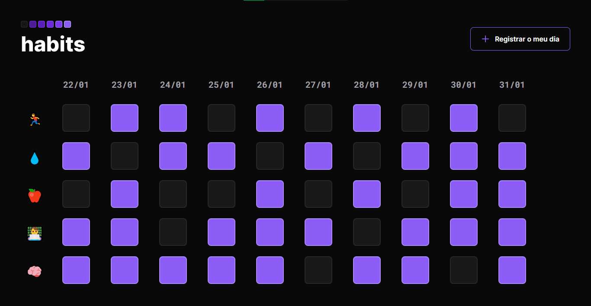

# Habit Tracker

## O Projeto 💻

Aplicação web desenvolvida durante a Next Level Week (NLW) Setup, o primeiro evento de programação de 2023 proporcionado pela <b><a href="https://rocketseat.com.br"> Rocketseat </a></b>.

Habit Tracker é uma <i>ferramenta de acompanhamento de hábitos</i>. Permite o usuário <u>registrar hábitos/ações e acompanhar as evoluções dos hábitos que deseja colocar em sua rotina</u>.

## Techs 🎯

Este projeto foi construído utilizando as seguintes tecnologias:

- HTML5: Hypertext Markup Language;
- CSS3: Cascade Style Sheets; e
- JS: Javascript; e
- GIT & Github.
- Figma: <b><a href="https://www.figma.com/file/bsFh7fuufkyiAYxkFYD1nd/Habits-(e)-(Community)?node-id=75%3A128&t=KknMCJNdeAF3QHUz-0">Visualização</a></b>

##

---

## View

